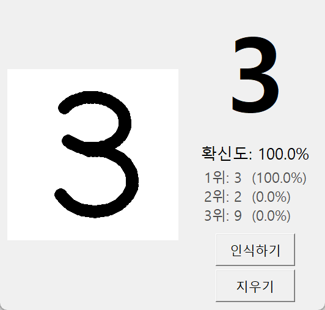

# 손글씨 숫자 인식기 (MNIST CNN)

PyTorch로 MNIST 데이터셋을 학습한 CNN이 **마우스로 쓴 숫자를 실시간으로 인식**하는 윈도우용 프로그램입니다.
코드, 주석, 변수·함수 이름까지 모두 한글로 작성했습니다.



## 주요 기능

- 흰 그림판에 숫자를 쓰고 마우스를 떼면 바로 인식
- 인식 결과, 확신도, 가능성 높은 숫자 3개를 함께 표시
- 테스트 데이터 정확도 **99.32%** (학습된 가중치 `mnist_cnn.pt` 포함, 바로 실행 가능)
- 콘솔 창 없이 실행되는 바탕 화면 바로가기와 전용 아이콘, 작업 표시줄 고정 지원

## 실행 환경

- Windows 10/11
- Python 3.10 이상 (Python 3.13에서 확인)
- PyTorch, torchvision, NumPy, Pillow (tkinter는 Python에 기본 포함)

```bash
pip install torch torchvision numpy pillow
```

> 여러 버전의 Python이 설치되어 있다면 패키지를 설치한 버전으로 실행해야 합니다.
> 예: `py` 명령이 패키지 없는 다른 버전을 가리키면 `py -3.13 app.py`처럼 버전을 지정하세요.

## 사용법

### 1. 앱 실행

```bash
python app.py
```

| 동작 | 방법 |
|---|---|
| 숫자 쓰기 | 그림판에서 마우스 왼쪽 버튼을 누른 채 끌기 |
| 인식 | 마우스를 떼면 자동, 또는 `인식하기` 버튼 / `Enter` |
| 지우기 | `지우기` 버튼 / `Esc` / `Delete` |

### 2. 직접 학습하기 (선택)

저장소에 학습된 가중치가 들어 있으므로 필수는 아닙니다. 처음 실행하면 MNIST 데이터(약 64MB)를 `data/` 폴더에 자동으로 내려받습니다.

```bash
python train.py
```

CPU 기준 에폭당 약 37초, 5에폭 학습에 약 3분이 걸립니다. 평가 정확도가 가장 높을 때의 가중치만 `mnist_cnn.pt`로 저장합니다.

| 에폭 | 손실 | 평가 정확도 |
|:-:|:-:|:-:|
| 1 | 0.3791 | 98.33% |
| 2 | 0.1554 | 98.59% |
| 3 | 0.1110 | 99.10% |
| 4 | 0.1013 | 99.13% |
| 5 | 0.0903 | **99.32%** |

### 3. 바탕 화면 바로가기 만들기 (선택)

```bash
powershell -ExecutionPolicy Bypass -File make_shortcut.ps1
```

바탕 화면과 시작 메뉴에 **"손글씨 숫자 인식기"** 바로가기가 생깁니다.
`pythonw.exe`로 실행하므로 검은 콘솔 창이 뜨지 않습니다.
작업 표시줄에 고정하려면 실행 중인 앱의 작업 표시줄 아이콘을 우클릭한 뒤 **"작업 표시줄에 고정"** 을 누르세요.

> 스크립트는 `py -3.13`으로 Python 경로를 찾습니다. 다른 버전을 쓴다면 스크립트의 해당 줄을 수정하세요.
> 폴더를 옮긴 뒤에는 스크립트를 다시 실행해야 합니다.

## 모델 구조

```
입력 (1×28×28)
 → 합성곱 3×3, 32채널 → 배치정규화 → ReLU → 최대풀링   (32×14×14)
 → 합성곱 3×3, 64채널 → 배치정규화 → ReLU → 최대풀링   (64×7×7)
 → 펼치기 → 완전연결 128 → ReLU → 드롭아웃 0.3
 → 완전연결 10 (숫자 0~9)
```

- 최적화: Adam (학습률 0.001, 2에폭마다 절반으로 감소)
- 데이터 증강: 회전 ±10°, 이동 ±10%, 크기 0.9~1.1배

## 손글씨 전처리

그림판 글씨를 그대로 줄이면 MNIST와 모양이 달라 인식률이 떨어집니다.
그래서 MNIST 원본 데이터를 만든 방식과 똑같이 전처리합니다.

1. 글씨가 있는 영역만 잘라내기
2. 가로세로 비율을 유지하며 긴 변을 20픽셀로 축소
3. 28×28 검은 바탕 가운데에 배치
4. 글씨의 무게중심을 정중앙 (14, 14)으로 이동
5. 학습 때와 같은 평균(0.1307)·표준편차(0.3081)로 정규화

MNIST 테스트 이미지 500장을 그림판 크기로 키워 이 과정을 거치게 했을 때 99.6%를 정확히 인식했습니다.

## 파일 구성

| 파일 | 설명 |
|---|---|
| `model.py` | CNN 모델 정의 (`MnistCNN`) |
| `train.py` | MNIST 학습 및 가중치 저장 |
| `app.py` | 손글씨 인식 GUI 앱 |
| `mnist_cnn.pt` | 학습된 가중치 |
| `make_icon.py` | 앱 아이콘(`app_icon.ico`) 생성 |
| `make_shortcut.ps1` | 바탕 화면·시작 메뉴 바로가기 생성 |
